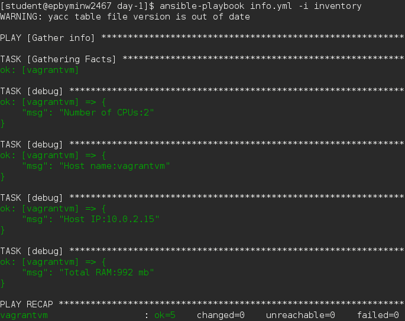

# Lab Work Task. Tomcat AS Provisioning

### Task
##### On Host Node (Control Machine):
##### 1. Install Ansible v2.3.1 with python pip. Report details where ansible has been installed.

##### 2. Spin up clear CentOS6 VM using vagrant (“vagrant init sbeliakou-centos-7.3-x86_64-minimal”). Verify connectivity to the host using ssh keys (user: vagrant)

##### 3. Create ansible inventory file ([inventory](inventory)) with remote host connection details:
###### Remote VM hostname/ip/port, Remote ssh login username, Connection type

##### 4. Test ansible connectivity to the VM with ad-hoc command: 
###### $ ansible VM-name -i inventory -m setup
###### Find out host details: Number of CPUs, Host name, Host IP(s), Total RAM

##### 5. Develop a playbook ([tomcat_provision.yml](tomcat_provision.yml))

##### 6. Verification Procedure

